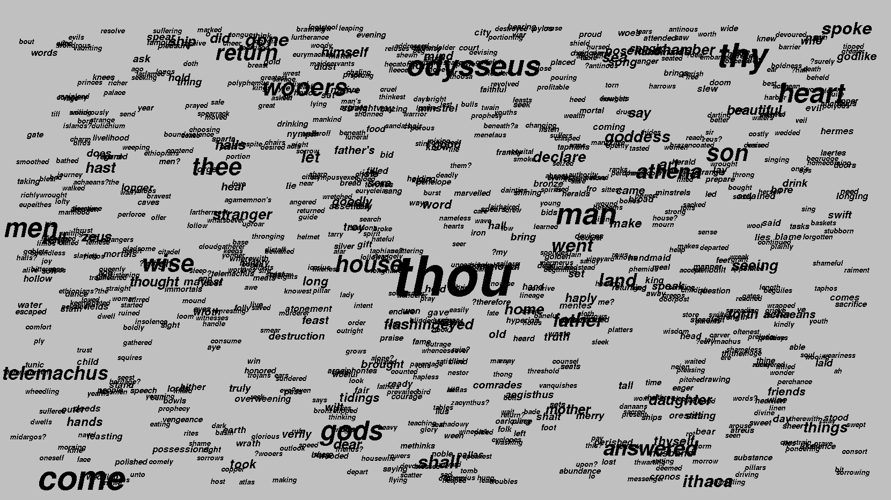

# ISC_Advanced_Programming
.
# Kata5: Infographic

## Problem Description

You want to build a _word cloud_, an infographic where the size of a word corresponds to how often it appears in the body of text.

To do this, you'll need data. Write code that builds its word cloud data in a **hash map**, where the keys are words and the values are the number of times the words occurred.

Think about capitalized words. For example, look at these sentences:
```
"After beating the eggs, Dana read the next step:"
"Add milk and eggs, then add flour and sugar."
```
What do we want to do with "After", "Dana", and "add"? In this example, your final hash map should include one "Add" or "add" with a value of 2. Make reasonable (not necessarily perfect) decisions about cases like "After" and "Dana".

Assume the input will only contain words and standard punctuation.

## Breakdown

This problem sounds very easy at first, we're even told which data structure to use. But, we do have to consider each word's format and punctuation, so things get a bit trickier. First, if we want to be looking at just the words themselves, we should remove all punctuation characters like _','_, _'-'_, _'.'_, _'('_, _')'_, _'!'_, and '?', right? But even this wouldn't be enough to take into account different upper and lower cases. To help tackle this, we could for example consider certain uppercase-lowercase combination valid only if it's present more than once in the text, or just consider them all as uppercase or lowercase. None of these choices is ideal, but some techniques are easier and more straight forward than others.<br/>
<br/>
Also, we must consider that the English language has many _stop words_. Stop Words, as explained [here](http://xpo6.com/list-of-english-stop-words/) are _"words that do not appear in the index in a particular database because they are either insignificant (i.e., articles, prepositions) or so common that the results would be higher than the system can handle"_. So, our program first reads a txt file with these stop words so that I can later just ignore any word if it's been seen before in this list. Finally, I show a GUI with each word's size according to its frequency, on a random location within the screen.<br/>
<br/>
You can see my full solution to this problem in this directory in **C++11**. For this, it's necessary to install FLTK. The resulting word cloud shown should look something like this:<br/>

