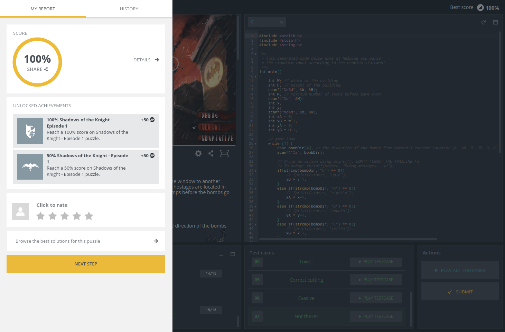

# Kata 7: Batman, Shadows of the Knight
Coding challenge from CodinGame: https://www.codingame.com/ide/puzzle/shadows-of-the-knight-episode-1

## Problem Description
Batman will look for the hostages on a given building by jumping from one window to another using his grapnel gun. Batman's goal is to jump to the window where the hostages are located in order to disarm the bombs. Unfortunately he has a limited number of jumps before the bombs go off...

### Rules
Before each jump, the heat-signature device will provide Batman with the direction of the bombs based on Batman current position:
```
U (Up)
UR (Up-Right)
R (Right)
DR (Down-Right)
D (Down)
DL (Down-Left)
L (Left)
UL (Up-Left)
```
 <br/>
Your mission is to program the device so that **it indicates the location of the next window Batman should jump to in order to reach the bombs' room as soon as possible.** <br/>

Buildings are represented as a rectangular array of windows, the window in the **top left corner of the building is at index (0,0)**.

## Game Input
The program must first read the initialization data from standard input. Then, within an infinite loop, read the device data from the standard input and provide to the standard output the next movement instruction.

### Initialization input
```
Line 1: 2 integers W H. The (W, H) couple represents the width and height of the building as a
        number of windows.
Line 2: 1 integer N, which represents the number of jumps Batman can make before the bombs go off.
Line 3: 2 integers X0 Y0, representing the starting position of Batman.
```
### Input for one game turn
The direction indicating where the bomb is.
### Output for one game turn
A **single line** with 2 integers *X* *Y* separated by a space character. (*X*, *Y*) represents the location of the next window Batman should jump to. *X* represents the index along the horizontal axis, *Y* represents the index along the vertical axis. (0,0) is located in the top-left corner of the building.

### Constraints
1 ≤ W ≤ 10000 <br/>
1 ≤ H ≤ 10000 <br/>
2 ≤ N ≤ 100 <br/>
0 ≤ X, X0 < W <br/>
0 ≤ Y, Y0 < H <br/>
Response time per turn ≤ 150ms <br/>
Response time per turn ≤ 150ms <br/>

## Breakdown
Ok, so at every turn, we get very helpful clues as to where the bomb is. If, for example the heat-signature device reads the bomb is in the *U* direction, we know we can ignore everything below us from now on. Or, even better, if it said the bomb is in the *UL* direction, we can just focus on the upper-left quadrant and ignore all the other three.<br/>
<br/>
And so, at every turn we reduce the possible windows we have to look at. But, how do we find the right window as fast as possible? Well, for that we can do a *2D binary search*. We tell Batman to move to the middle of the zone we know so far the bomb is in. This way, at every turn we'll be cutting out the windows we look for in **up to 75%**!<br/>
</br>
For this, I keep track of the horizontal and vertical range of windows we're looking at in each turn. Initially, this range of windows is the complete building itself, but as we get clues from the heat-signature device as described before, this range gets smaller and smaller until we're only looking at a single window, the one containing the bomb. And batman saves the day.

## Solution
I invite you to go checkout my implementation of this solution in *C*. Even better, go and try it out in the CodinGame platform to see Batman move through the building as the program runs!<br/>
And in doing so, you'll be able to see all tests passing, with **100%** success rate:<br/>

